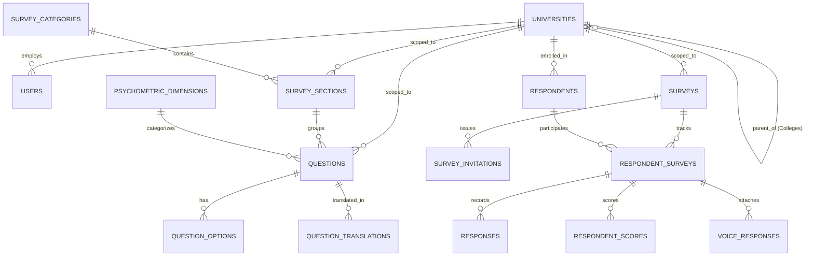

# StateSkillInsight: Comprehensive Higher Education & Skill Assessment Platform

[](https://laravel.com)
[](https://php.net)
[](https://getbootstrap.com)
[](https://mysql.com)
[](https://phpspreadsheet.readthedocs.io/)
[](https://developer.mozilla.org/en-US/docs/Web/API/Web_Audio_API)

---

## Table of Contents
1. [Executive Summary & Purpose](#executive-summary--purpose)
2. [Project Objectives & Scope](#project-objectives--scope)
3. [Key Highlights & Capabilities](#key-highlights--capabilities)
4. [System Architecture & Core Modules](#system-architecture--core-modules)
   - [1. Multi-Tier Institution Directory & Affiliation Hierarchy](#1-multi-tier-institution-directory--affiliation-hierarchy)
   - [2. Survey Campaign Engine & Targeting](#2-survey-campaign-engine--targeting)
   - [3. Question Bank & Psychometric Taxonomy](#3-question-bank--psychometric-taxonomy)
   - [4. Category & Section Taxonomy](#4-category--section-taxonomy)
   - [5. Respondent Survey Experience & Web Audio Voice Engine](#5-respondent-survey-experience--web-audio-voice-engine)
   - [6. Scoring, Psychometric Indices & Gap Analysis](#6-scoring-psychometric-indices--gap-analysis)
   - [7. State Analytics, Cross-Tabulations & Dynamic Reports](#7-state-analytics-cross-tabulations--dynamic-reports)
   - [8. Security, RBAC & Audit Trail](#8-security-rbac--audit-trail)
5. [User Roles & Permissions Matrix](#user-roles--permissions-matrix)
6. [Data Model & Entity Relationships](#data-model--entity-relationships)
7. [Installation & Setup Guide](#installation--setup-guide)
8. [Configuration & Environment (.env)](#configuration--environment-env)
9. [Operational Workflows](#operational-workflows)
10. [Troubleshooting & Maintenance](#troubleshooting--maintenance)

---

## Executive Summary & Purpose

**StateSkillInsight** is an enterprise-grade state-level higher education analytics, psychometric evaluation, and skill insight platform. It is engineered to monitor, evaluate, benchmark, and improve academic and industry-readiness skills across universities, colleges, autonomous institutes, and technical training centers across the entire state.

The platform bridges the gap between state policymakers, university administrators, educators, and students by providing high-fidelity survey campaigns, automated psychometric evaluations, voice-enabled qualitative insights, and multidimensional analytics dashboards.

---

## Project Objectives & Scope

### Purpose
To establish a centralized, reliable, and scalable digital assessment platform for capturing student skills, attitudes, employability indices, academic feedback, and psychometric dimensions across higher education institutions.

### Core Objectives
1. **Standardized Assessment**: Provide standardized, structured diagnostic assessments categorized into academic, technical, behavioral, and soft-skill domains.
2. **State & Institutional Benchmarking**: Facilitate real-time comparative analysis between universities, constituent colleges, disciplines, and districts.
3. **Data-Driven Policy Interventions**: Equip state higher education councils and university leadership with diagnostic intelligence to formulate curriculum enhancements and skill training interventions.
4. **Multimodal Insight Capture**: Combine traditional quantitative Likert/Choice questions with browser-based Web Audio qualitative responses for authentic sentiment analysis.
5. **Granular Access & Institutional Governance**: Empower individual institutions with self-governing administrative portals while maintaining centralized state oversight and compliance.

### Scope of Coverage
- **Institutions**: State Universities, Central Universities, Autonomous Institutes, Institutes of National Importance (INIs), Affiliated Degree/Engineering Colleges, and Polytechnic / ITI Centers.
- **Respondents**: Undergraduates, Postgraduates, Technical Trainees, Faculty Members, and Alumni.
- **Administrative Reach**: State Council / Super Administrators, University System Admins, College Principals, and Department Heads.

---

## Key Highlights & Capabilities

- 🏛️ **Affiliation-Aware Hierarchy Engine**: Auto-propagates and cascades institution selection from affiliating universities to all child colleges in a single click.
- 🎙️ **In-Browser Web Audio Voice Responses**: Enables respondents to record voice answers directly in the browser; administrators can stream, inspect, and evaluate recordings in the dashboard.
- 📊 **Dynamic State-Wide & University-Wise Reporting**: Real-time aggregation of metrics across all institutions without hardcoded IDs, supporting filters by Category, Section, and Dimension.
- ⚡ **Strict Excel Bulk Import / Export**: Validated question upload template with duplicate statement detection per category and automated Likert scale auto-population.
- 🌐 **Multi-Language Support**: Seamless locale switching (English, Regional Languages) for survey taking.
- 🔒 **Comprehensive Audit Logs & RBAC**: Every administrative action (creates, updates, status toggles, deletions) is tracked with timestamps, actor IDs, and IP addresses.

---

## System Architecture & Core Modules

### 1. Multi-Tier Institution Directory & Affiliation Hierarchy
- **Institution Classification**:
  - `University` (Parent / Affiliating or Standalone)
  - `INI` (Institutes of National Importance: IITs, NITs, AIIMS)
  - `Affiliated College` (Linked to a parent university via `parent_id`)
  - `Polytechnic / ITI` (Technical Training Centers)
- **Cascading Selection Engine**:
  - Available across **Survey Creation/Edit**, **Section Creation/Edit**, and **Question Creation/Edit**.
  - Selecting an affiliating university (e.g., *BPUT*, *Utkal University*) automatically checks/unchecks all affiliated colleges with visual feedback notifications.
  - Dedicated *"Select by Affiliating University"* quick selector with `Auto-Select All Colleges` and `Deselect All` buttons.
  - Parent badges show `{N} Colleges` and child badges show `Affiliated to: {Parent Name}`.
  - Real-time search by college name, short code, or affiliating parent name.

### 2. Survey Campaign Engine & Targeting
- **Campaign Configuration**:
  - Title, description, academic year, target start/end dates, status (`draft`, `published`, `closed`).
  - Target institution scope: **Global (Common to all institutions)** or **Specific Institution(s)**.
  - Demographic filters: Batch years, Departments, Branches, Semesters, Degree levels.
- **Distribution & Access Channels**:
  - Public registration link by category.
  - Token-based Magic Links for unique, authenticated, one-time survey completion.
  - Batch Email Invitations with automated status tracking (`sent`, `opened`, `completed`).
- **Resumable & Auto-Saving Experience**:
  - Real-time client-side auto-save on answer change via background AJAX requests (`/survey/{token}/auto-save`).
  - Respondents can pause and resume surveys from any device without data loss.

### 3. Question Bank & Psychometric Taxonomy
- **Supported Question Types**:
  1. `Single Choice (Radio)`: Mutually exclusive single options.
  2. `Multiple Choice (Checkbox)`: Multi-select answers.
  3. `Dropdown`: Dropdown select with single selection.
  4. `Likert Scale (1-5)`: Auto-populates 5 standard points (*Strongly Disagree, Disagree, Neutral, Agree, Strongly Agree*).
  5. `Rating (1-5 Stars)`: Interactive star rating.
  6. `Short Text`: Single-line textual input.
  7. `Long Text`: Multi-line textual response.
  8. `Voice Answer`: Browser-based Web Audio recording with client-side playback before submission.
- **Bulk Excel Import & Validation**:
  - Excel template generated via **PhpSpreadsheet** with validation dropdowns and column guides.
  - Automatic Likert option filler (*Strongly Disagree to Strongly Agree*).
  - **Duplicate Question Detection**: Rejects duplicate question statements in the same category to maintain bank hygiene.
  - Super Admin / Institution-scoped bulk import.

### 4. Category & Section Taxonomy
- **Survey Categories**:
  - Major assessment pillars (e.g., *Category 1: Academic & Cognitive*, *Category 2: Industry Readiness*, *Category 3: Socio-Emotional*, *Category 4: Institution Infrastructure*).
- **Survey Sections**:
  - Modular sub-groups of questions under categories.
  - Configurable as **Common / Global** or **Institution-Specific**.
  - Section-level question counters and toggle switches for quick activation/deactivation.

### 5. Respondent Survey Experience & Web Audio Voice Engine
- **Responsive Survey UI**:
  - Section-by-section progressive stepper with progress indicator.
  - Mobile-friendly cards, clear typography, and touch-friendly controls.
  - Question translation support for regional language switching.
- **Voice Recording Pipeline**:
  - Uses modern **MediaRecorder API** and **Web Audio API** in PCM/WebM/WAV formats.
  - Waveform / timer indicator during recording.
  - Direct upload to secure storage via `/survey/{token}/voice-upload`.
  - Integrated in-portal audio player in respondent answer sheets and analytics inspect view.

### 6. Scoring, Psychometric Indices & Gap Analysis
- **Psychometric Dimensions**: Tagging questions to core dimensions (e.g., *Critical Thinking*, *Leadership*, *Communication*, *Technical Competency*).
- **Scoring Engine**:
  - Quantitative normalization of Likert & Rating points (1.0 – 5.0 scale converted to 0 – 100% index).
  - Aggregate scores calculated per respondent, section, category, and dimension.
  - Benchmark computation against institutional and state-level percentiles.

### 7. State Analytics, Cross-Tabulations & Dynamic Reports
- **Executive Analytics Dashboard**:
  - Total institutions, registered respondents, completed surveys, response rates.
  - Category-wise radar and bar charts for state averages vs. university averages.
  - District-wise participation distribution maps.
- **Dynamic Report Generator (`/admin/reports`)**:
  - State-wide overview report covering all institutions automatically without hardcoded fallbacks.
  - Institution-specific deep-dive reports with comparative benchmarks.
  - Export capabilities: CSV, Excel, and Print-ready HTML/PDF formatting.
- **Respondent Profile & Answer Inspector**:
  - Full breakdown of demographic profile, completion time, section scores, question answers, and audio player for submitted voice responses.

### 8. Security, RBAC & Audit Trail
- **Strict Role-Based Access Control (RBAC)**:
  - Super Admin: Complete state-level oversight, global content creation, institution management, cross-institutional analytics.
  - University / College Admin: Scoped access to own institution, local question authoring, institution-specific respondent analytics.
  - Respondent: Secure token-based access strictly limited to survey execution.
- **Audit Logging Engine**:
  - Logs `created`, `updated`, `deleted`, `cloned`, and `imported` actions with entity model name, record ID, user ID, and IP address.

---

## User Roles & Permissions Matrix

| Feature / Module | Super Administrator | University / College Admin | Student / Respondent |
| :--- | :---: | :---: | :---: |
| **Manage Institutions & Colleges** | Full Access (Create/Edit/Import) | View Own Profile | No Access |
| **Manage Global Categories & Sections** | Full Access | View Only | No Access |
| **Create Institution-Specific Sections** | Full Access | Own Institution Only | No Access |
| **Global Question Bank Management** | Full Access | View Only | No Access |
| **Local Question Authoring & Bulk Import** | Full Access | Own Institution Only | No Access |
| **Create & Launch Survey Campaigns** | Full Access (Global & Scoped) | Scoped to Institution | No Access |
| **Take Survey & Upload Voice Answer** | Preview Only | Preview Only | Full Access |
| **View State-Wide Aggregated Reports** | Full Access (All Institutions) | Benchmarked View | No Access |
| **Access In-Browser Voice Media Player** | Full Access | Own Institution Only | No Access |
| **Export Data & Analytics (CSV/Excel)** | Full Access | Own Institution Only | No Access |
| **User & Staff Account Management** | Full Access | Limited Institutional | No Access |
| **Audit Logs Inspection** | Full Access | No Access | No Access |

---

## Data Model & Entity Relationships



---

## Installation & Setup Guide

### Prerequisites
- **PHP**: `^8.2` with extensions: `pdo_mysql`, `mbstring`, `openssl`, `xml`, `curl`, `gd`, `zip`
- **Web Server**: Apache / Nginx (or XAMPP / WampServer)
- **Database**: MySQL `^8.0` or MariaDB `^10.4`
- **Composer**: `^2.2`
- **Node.js & NPM**: `Node ^18.x` / `NPM ^9.x`

### Step 1: Clone or Place Repository
```bash
cd c:\xampp\htdocs
git clone <repository-url> StateSkillInsight
cd StateSkillInsight
```

### Step 2: Install Dependencies
```bash
composer install
npm install
```

### Step 3: Environment Configuration
Copy the example environment file and configure database credentials:
```bash
cp .env.example .env
php artisan key:generate
```

Edit your `.env` file:
```ini
APP_NAME="StateSkillInsight"
APP_ENV=local
APP_KEY=base64:...
APP_DEBUG=true
APP_URL=http://127.0.0.1:8000

DB_CONNECTION=mysql
DB_HOST=127.0.0.1
DB_PORT=3306
DB_DATABASE=stateskillinsight
DB_USERNAME=root
DB_PASSWORD=
```

### Step 4: Run Database Migrations & Seeders
```bash
php artisan migrate --seed
```

### Step 5: Link Storage for Voice & Media Uploads
```bash
php artisan storage:link
```

### Step 6: Build Assets & Start Development Server
```bash
npm run build
php artisan serve
```
Access the application at `http://127.0.0.1:8000`.

---

## Configuration & Environment (.env)

Key environment settings for tuning the application:

```ini
# Application Locale Settings
APP_LOCALE=en
APP_FALLBACK_LOCALE=en

# Session & Cache Drivers
SESSION_DRIVER=database
SESSION_LIFETIME=120
CACHE_STORE=database

# File Storage Configuration
FILESYSTEM_DISK=public

# Mail Driver (for Survey Invitations)
MAIL_MAILER=smtp
MAIL_HOST=smtp.mailtrap.io
MAIL_PORT=2525
MAIL_USERNAME=your_username
MAIL_PASSWORD=your_password
MAIL_ENCRYPTION=tls
MAIL_FROM_ADDRESS="no-reply@stateskillinsight.gov.in"
MAIL_FROM_NAME="${APP_NAME}"
```

---

## Operational Workflows

### 1. Creating a Targeted Survey Campaign
1. Navigate to **Surveys -> Create Survey**.
2. Fill Title, Academic Year, Date Range, and Target Categories.
3. Under **Target Institution Scope**:
   - Choose **Common / All Institutions** for state-wide coverage, or
   - Choose **Specific Institution(s)** and use the **Select by Affiliating University** quick selector to select universities and all affiliated colleges automatically.
4. Save and publish the campaign.

### 2. Bulk Importing Questions into the Question Bank
1. Navigate to **Question Bank -> Bulk Import Questions**.
2. Click **Download Sample Excel Template**.
3. Fill in the statement, category code, question type (`likert`, `single_choice`, `voice`, etc.), and psychometric dimension.
4. Upload the Excel file. The system will validate headers, check for duplicate statements in the category, and auto-populate default Likert points.

### 3. Reviewing Voice Responses
1. Navigate to **Voice & Media -> Voice Responses** or inspect an individual student in **Respondents -> View Answers**.
2. Use the in-browser HTML5 Audio Player to listen to respondent voice answers, read automated transcripts (if available), and assess communication metrics.

### 4. Generating Institutional & State Reports
1. Navigate to **Reports & Analytics -> Reports**.
2. Select the Report Scope (*All Colleges / State-wide* or *Specific University / College*).
3. Filter by category, section, or psychometric dimension to review diagnostic distribution, benchmark rankings, and download PDF/CSV summaries.

---

## Troubleshooting & Maintenance

### Clearing & Re-caching Application State
```bash
# Clear all caches during updates
php artisan config:clear
php artisan route:clear
php artisan view:clear
php artisan cache:clear

# Re-optimize for production performance
php artisan config:cache
php artisan route:cache
php artisan view:cache
```

### Checking Media Upload Permissions
Ensure `storage/app/public/voice_responses` directory exists and has write permissions:
```bash
# Verify symbolic link
php artisan storage:link
```

---

## License & Support

Developed for State Higher Education Councils and Higher Education Quality Assurance Boards.  
© 2026 **StateSkillInsight**. All rights reserved.
